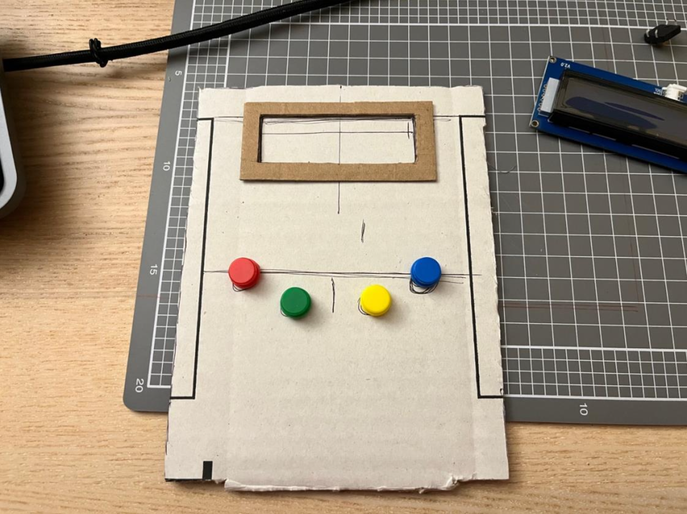
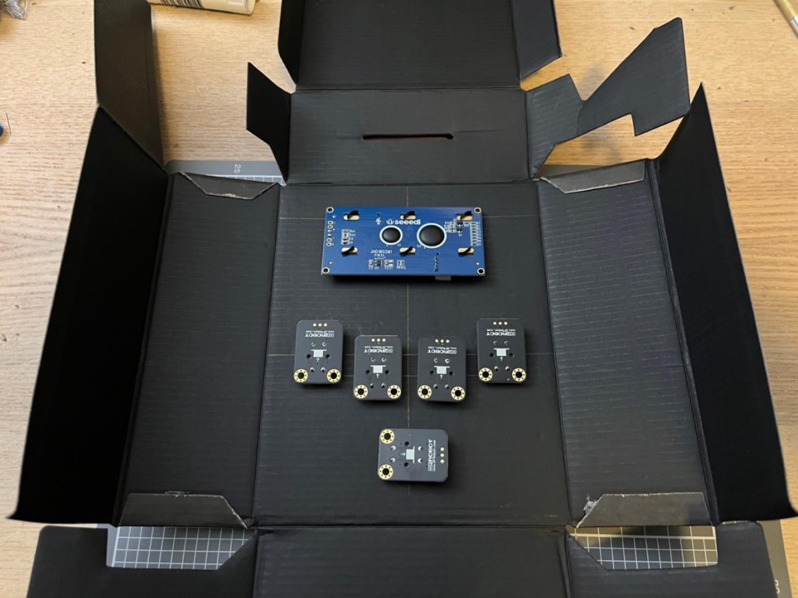
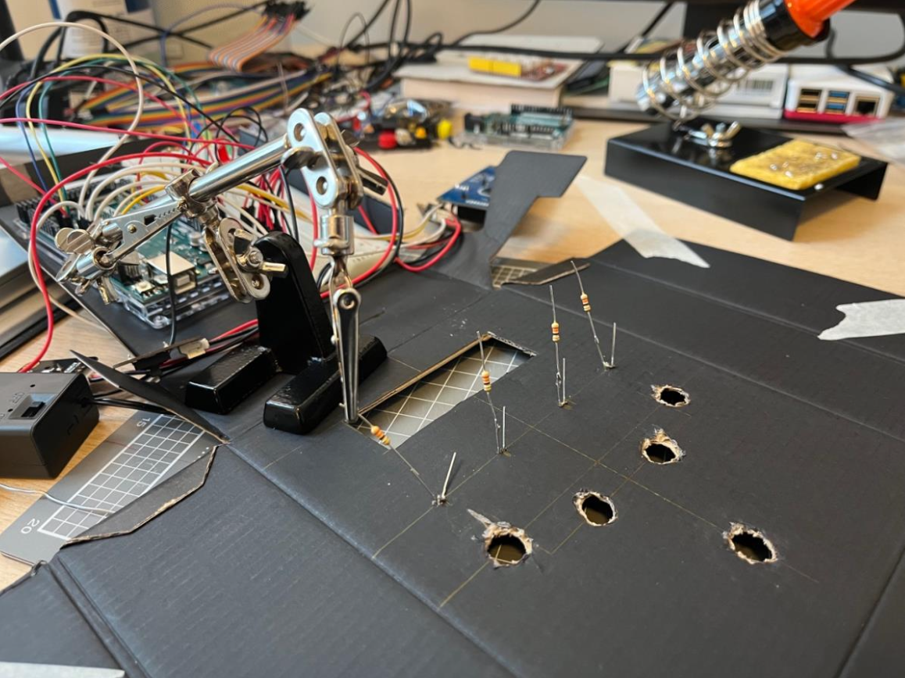
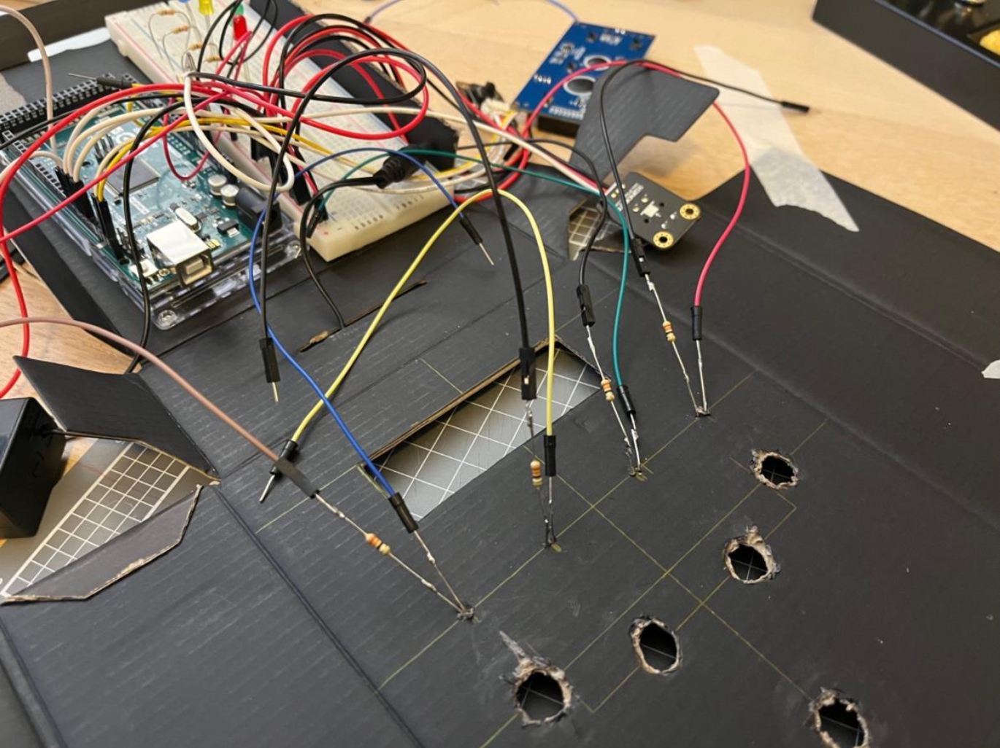
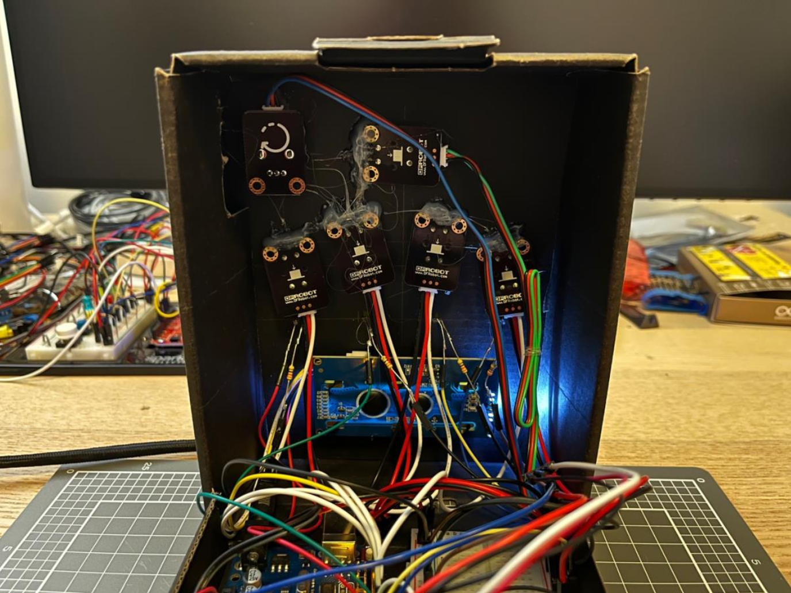
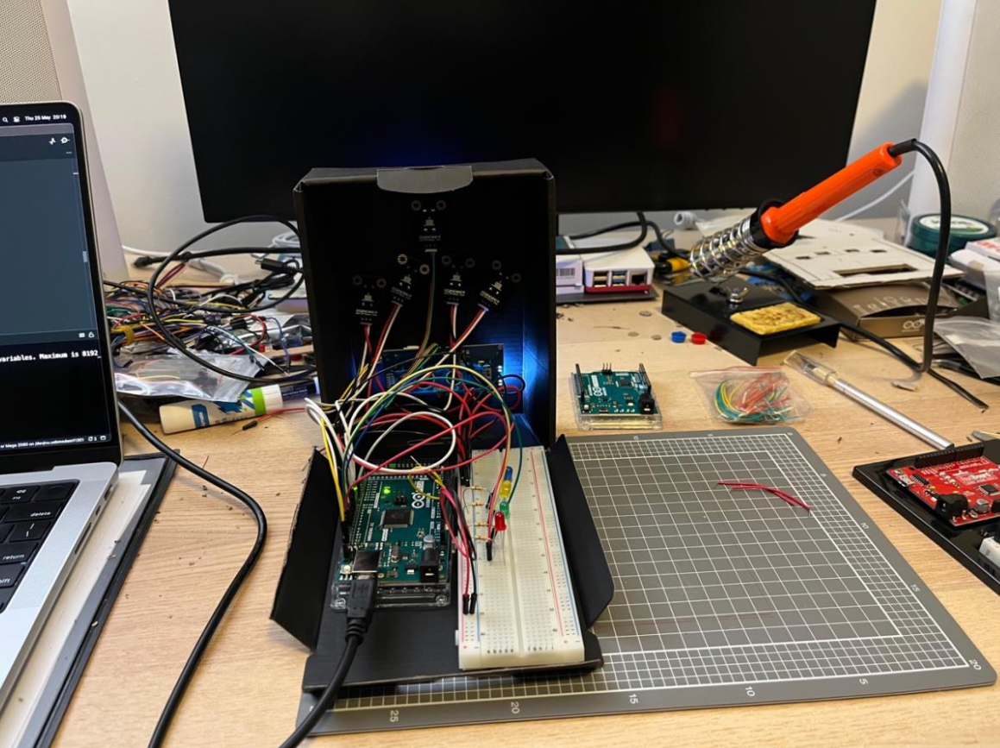
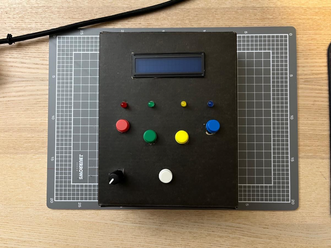

# Arduino Memory Game

As part of an assignment for university, this project was essential for me to develop skills in interactive prototyping and C++.

[**Video**] You can find a more detailed overview of the game and physical design in this video: [https://youtu.be/zJscLV0aoM8](https://youtu.be/zJscLV0aoM8)

## Production process

I started by measuring the dimensions in a piece of cardboard box and then cutting the holes in the actual box to place the components.

Then, once I felt that those were the best spots, I moved on to soldering the coloured LED lights that would correspond to each button.

Once that was done, I move on to wire everything up and hot-glue the buttons so that they would not fall off when pressed.

And this was the final result:

